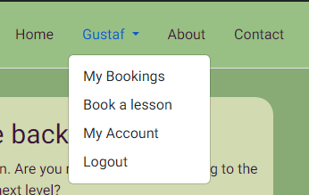
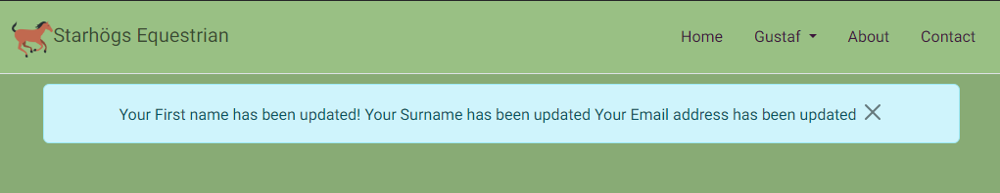
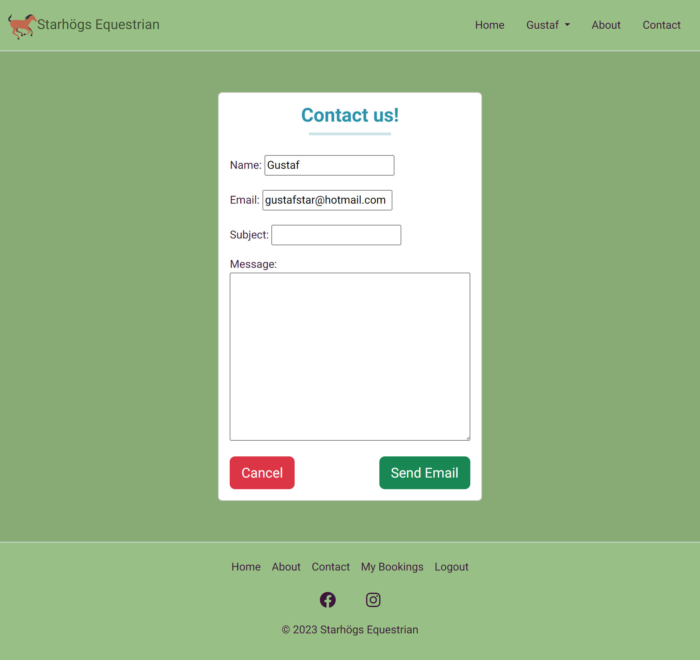
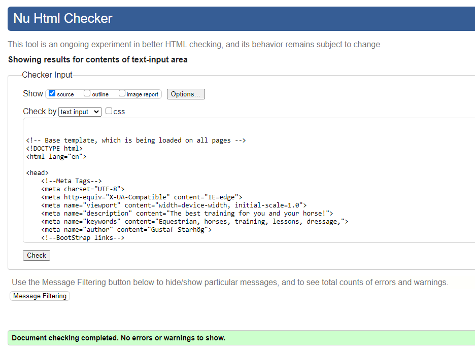
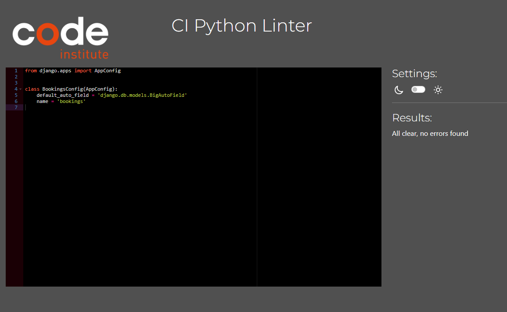
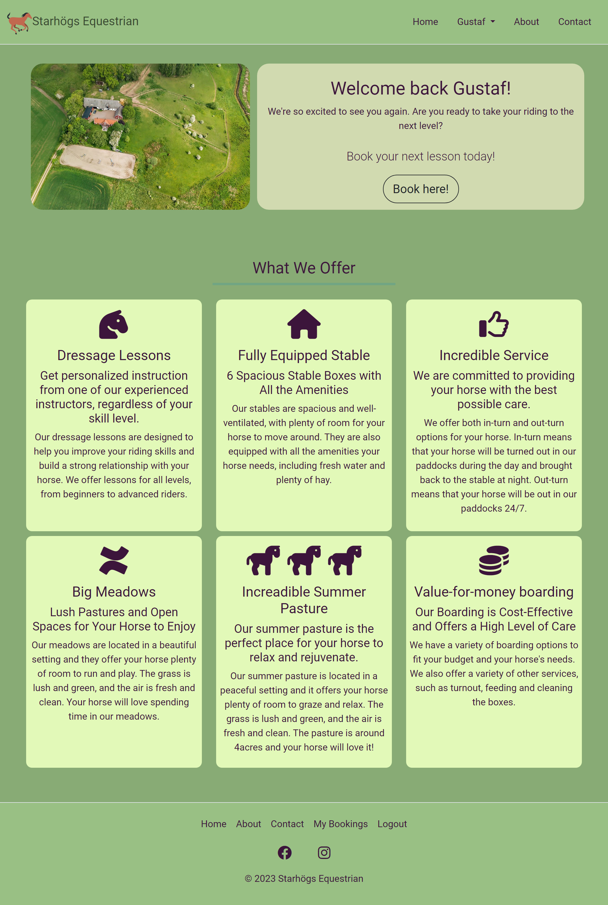

# Django project (Project Portfolio 4) for Code Institute.

## General information
Starhögs Equestrian is a website where you can improve your dressage riding skills. The website provides you with the ability to create your own account and add in your personal details, should you wish. After a user has created their account they can now book riding lessons with an instructor. 

The website has full CRUD functionality, which means that a user can:
- Create a booking.
- Read/View their booking.
- Update their booking.
- Delete their booking.

The idea for this website was to create something that could help my wife with her real life dressage lesson business and make it easier for her to maintain and have control over her schedule. Although there is more that I want to add to the project, this will be future implementations, which you can read more about further down in this documentation.

Link to the application: [Click Here!](https://star-pro4-3dc81848625c.herokuapp.com/)

---

---
## Table of Contents

 - ## [General Information](#general-information)

 - ## [Table of Contents](#table-of-contents-1)

 - ## [UX](#UX-1)

 - ## [Project Goals](#project-goals-1)

 - ## [User Stories](#user-stories-1)

 - ## [Flowchart](#Flowchart-1)

 - ## [General features](#general-features-1)
    
- ## [Testing](#testing-1)
    - ## [Code Validation](#code-validation-1)
    - ## [Testing User Stories](#testing-user-stories-1)
    - ## [Manual Testing](#manual-testing-1)
    - ## [Future improvements](#Future-improvements-1)
- ## [Bugs](#Bugs-1)

- ## [Libraries and Software](#Libraries-and-Software-1)

- ## [Final Result](#final-result-1)

- ## [Deployment](#deployment-1)

- ## [Github Pages](#github-pages-1)

- ## [Credits](#credits-1)
---
## UX
The purpose of the site is to provide an easy understandable website with a simple and easy way for the user to create a booking. The site should be pleasing to the eye and to make a booking should be very simple.
No flashy colors were used, but the colors were calm and pleasing to interact with.
A favicon were used to make the website look better in the tab-bar.

### Colors and Fonts used:

#### Font
The Font I chose is from GoogleFonts and are free to use. I chose the font called "Roboto" with sans-serif as a fallback font. 
Roboto is clean and easy to read. 

#### Color
The main colors used on the site are:
- The text color for the site is: #3c153b.
- The background color for the site is: #88ab75.
- The navbar and the footer uses the color: #99c084. 

## Project Goals
The project goals was to create a website using the Django Framework in Python along with HTML CSS and Javascript. A user should be able to create a booking for their dressage lesson at available times and should be able to be up to 3 participants per lesson. 

A Database was set up to handle all data and to ensure correct booking and tracking was applied. 

A user should not be able to create or edit any booking without being authorized on the site. Contacting the admin does not require a login status.

---
# User Stories

| **EPIC** | **ID #** | **User Story** | **Github project** |
|-------------|------------|---------------------|---------------------|
| **User Authorization** |
|  | 1 | As a Site User I can register for an account so that I can book, update and delete my bookings | [Link](https://github.com/users/gStarhigh/projects/4/views/1?filterQuery=label%3A%22User+Authorization%22&pane=issue&itemId=33280441) |
|  | 2 | As a Site User I can easily see my login status so that I know if I'm logged in or not to the site. | [Link](https://github.com/users/gStarhigh/projects/4/views/1?filterQuery=label%3A%22User+Authorization%22&pane=issue&itemId=33281113) |
|  | 14 | As a User I can see my account information so that I can add first name, lastname, adress, update email adress. | [Link](https://github.com/users/gStarhigh/projects/4/views/1?filterQuery=label%3A%22User+Authorization%22&pane=issue&itemId=34983028) |
| **Lesson Booking** |
|  | 3 | As a logged in user I can see all my bookings so that I know when I my bookings will take place. | [Link](https://github.com/users/gStarhigh/projects/4/views/1?filterQuery=label%3A%22Lesson+Booking%22&pane=issue&itemId=33281896) |
|  | 4 | As a Logged In Site User I can update and delete my bookings so that I can change or cancel my bookings. | [Link](https://github.com/users/gStarhigh/projects/4/views/1?filterQuery=label%3A%22Lesson+Booking%22&pane=issue&itemId=33282761) |
|  | 5 | As a logged in user I can create a booking so that it appears under "My Bookings". | [Link](https://github.com/users/gStarhigh/projects/4/views/1?filterQuery=label%3A%22Lesson+Booking%22&pane=issue&itemId=33283329) |
|  | 6 | As a Logged in User I can add information to my booking so that the teacher can be prepared for the lesson. | [Link](https://github.com/users/gStarhigh/projects/4/views/1?filterQuery=label%3A%22Lesson+Booking%22&pane=issue&itemId=33283779) |
|  | 13 | As a User I can filter my bookings so that I easily can see which has passed and which are upcoming. | [Link](https://github.com/users/gStarhigh/projects/4/views/1?filterQuery=label%3A%22Lesson+Booking%22&pane=issue&itemId=34977495) |
| **Home/ About pages** |
|  | 8 | As a user I can immediately understand the purpose of the site so that I can easily decide if it meets my needs. | [Link](https://github.com/users/gStarhigh/projects/4/views/1?filterQuery=label%3A%22Home%2FAbout+pages%22&pane=issue&itemId=33286328) |
|  | 9 | As a User I can read about the company so that I know who is running it and who the teacher is. | [Link](https://github.com/users/gStarhigh/projects/4/views/1?filterQuery=label%3A%22Home%2FAbout+pages%22&pane=issue&itemId=33286672) |
| **User Contact Abilities** |
|  | 10 | As a user I can contact the teacher so that I can get answers to my questions. | [Link](https://github.com/users/gStarhigh/projects/4/views/1?filterQuery=label%3A%22User+Contact+Abilities%22&pane=issue&itemId=33286913) |
| **Admin** |
|  | 15 | As a Admin I can approve lessons so that the user can see that it has been approved. | [Link](https://github.com/users/gStarhigh/projects/4/views/1?pane=issue&itemId=36399686) |
| **NOT IMPLEMENTED!** |
|  | 11 | As a Logger in User I can book a place for the summer pasture so that I have a place for my horse next summer. | [Link](https://github.com/users/gStarhigh/projects/4/views/1?pane=issue&itemId=33312687) |
|  | 7 | As a Logged in User I will get an email confirmation so that I know that my lesson has been confirmed. | [Link](https://github.com/users/gStarhigh/projects/4/views/1?pane=issue&itemId=33284416) |
|  | 12 | As a Logged in User I can book a box for my horse so that my box can stay long term at the farm. | [Link](https://github.com/users/gStarhigh/projects/4/views/1?pane=issue&itemId=33312758) |
---
## Flowchart

### Structure
The structure of the website is divided between authenticated user and not authenticated.
- Register page gives the user the possibility to create an account.
- Login page gives the user the possibility to login to an existing account.
- The Home page is visible for all users and displays images and information about the site.
- The Contact page is visibile for all users and displays a contact form. If the user is authenticated, the Username and Email will be pre-populated. If the user is NOT authenticated, the user will have to provide that information before submitting.
When the form is valid and sent, an email is sent to both the admin and the user.
- The About page displays images and information of the business. There is also an embedded video and an Google Maps API that displays the location.
- My Bookings page is only accessible if the user is logged in and displays all bookings made by the user. If there is no bookings made, an message will be displayed: "You have no bookings yet". The bookings are sorted by date. As a User you can filter your bookings by three variables: 
    
    All: Displays all bookings, regardless of date or status.

    Upcoming: Only displays "Approved" lessons that has not passed.

    Completed: Only displayes "Approved" lessons that has passed.
- The Book a lessons page is only accessible if the user is logged in. It displays the form neccessary to complete a booking. Here the user will be asked to enter the following information:
    
    Focus for the lesson
    
    Date: You are only able to book Monday to Friday.

    Time: You are only able to book the following times:
    18:00,19:00,20:00,21:00.

    Number of participants: Up to 3 people can share a lesson time.

    Level of the ekipage: Your level of dressage skills, chosen from a dropdown list.

    Terms of booking: A checkbox that must be checked. Terms can be read by pressing the link "Read terms here", that will open a modal.

- My account page is only accessible if the user is logged in and lets the user update the firstname, Lastname and email adress. There is also a readonly field containing the date and time the user created the account. 

#### Here is an image of the structure I used for this project.
The flowchart was made using [Lucidchart](https://lucid.co/).

#### Wireframes

#### Database

The project uses the PostgreSQL relational database for storing the data. It was setup using [ElephantSQL](https://www.elephantsql.com/). Read more about Elephant SQL in the [Deployment](#deployment-1) section.

The schema was made using [Lucidchart](https://lucid.co/).

---
## General features

#### Header and Navigation
The navbar is visible on all pages throughout the website. However it's different in apperance depending if you are logged in or not, if you are on a mobile device or a laptop/desktop. 

Of the navigation links there are 3 that are always visible no matter your loggin/out status. They are: Home, About and Contact. 

If you are not logged in, you will also see Register and Login.
    

    
Navbar example image desktop

    
    

    

    
Navbar example image mobile

    
    

    

    
Navbar example image mobile expanded menu

    
    

If you are logged in, you will see your Username, with a dropdown option.
    

    
Navbar example image desktop

    
    

    

    
Navbar example image desktop expanded dropdown

    
    

    

    
Navbar example image mobile

    
    

Above the navbar there is a message for the user prompting the user to login, if the user is not logged in. This message disappears if the user logs in.
    

    
Message example image desktop

    
    

    

    
Message example image mobile

    
    

#### Footer

The footer follows the same principle as the navbar, however with different links. The footer also contains 2 external links that will open in a new tab. Those are to Facebook, and to Instagram.

If the user is logged in, they will see the following links: "Home, About, Contact, My Bookings and Logout".
    

    
Footer example image desktop

    
    

    

    
Footer example image mobile

    
    

If the user is not logged in, they will see the following links: "Home, About, Contact, Register, Login".
    

    
Footer example image desktop

    
    

    

    
Footer example image mobile

    
    

#### Account

#### Create an account
- Allows a user to register an account on the website.
- Fields neccessary to fill out are: E-mail, Username, Password and Password confirmation.

Register example image desktop

Register example image mobile

#### Login to an account
- Allows a user to access otherwise restricted pages and their profile.

Login example image desktop

Login example image mobile

#### Login to an account
- Allows a user to sign out of their account.

Logout example image desktop

Logout example image mobile

### Main pages

#### Home Page
The Home page is the first the user encounter when entering the website. It's a hero image at the top next to a container with some information. This container is not the same for loggedin users as it is for loggedout users. 
    

    
Logged in example image desktop

    
    

    

    
Logged in example image mobile

    
    

    

    
Logged out example image desktop

    
    

    

    
Logged out example image mobile

    
    

Beneth that there are 6 containers with information about what the website has to offer. Those contain information about the following: Dressage Lessons, The Stable, Our Service, Meadows, Summer Pasture and Boarding.

#### My Bookings Page
On My Bookings page, the user can see all bookings that they have made, both past and upcoming. If there is no bookings made, an message will be displayed: "You have no bookings yet". The bookings are sorted by date. The user you can filter their bookings by three variables: 
    
- All: Displays all bookings, regardless of date or status.

- Upcoming: Only displays "Approved" lessons that has not passed.

- Completed: Only displayes "Approved" lessons that has passed.

    

    
Bookings page on Desktop

    
    

    

    
Bookings Page on Mobile

    
    

- If a lesson is not yet approved by the admin, the Status will read: "Awaiting approval" in red text.

- If a lesson is approved by the admin, the Status will read: "Approved" in green text. 

    

    
Approved lessons on Desktop

    
    

    

    
Approved lessons on Mobile

    
    

The user also has the ability to update or delete a booking that they have made. However a deletion of a booking is not allowed within 24hours of the starttime of the lesson (Stockholm time).

Update booking on Desktop

Update booking on Mobile

Delete booking on Desktop

Delete booking on Mobile

#### Book a Lesson Page
On Book a lessons page, the user can book a Dressage lesson for up to 3 participants per lesson. The user has the ability to choose from Monday to Friday, and the times: 18:00, 19:00, 20:00, 21:00.

The user then have to choose:
- Between 1 and 3 participants.
- The level of their skills as an ekipage.

The user also has to check the Terms checkbox. When the user has successfully filled out the form, the booking will be available for the user to see, update and delete on "My bookings" page. The user(and Admin) will also get a confirmation email that the booking has been taken place. 

Create booking on Desktop

Create booking on Mobile

Confirmation Email to Admin

Confirmation Email to User

#### My Account Page
On My account page, the user has the ability to add their First and Lastname to their account. These are not required fields when registering to the website. The user can also change their email address if for example, they have a new one. 

All changes will be met with a message to the user that tells the user what they updated. If the user updates more than one field at the same time, multiple messages will be shown as one. 

My account on Desktop

My account on Mobile

Updating firstname desktop

Updating firstname mobile

Updating surname desktop

Updating surname mobile

Updating multiple fields desktop

Updating multiple fields mobile

#### About Page
- The About page contains extensive information about the instructor and all the things the company offers. 
- Below the information section there is a banner that leads to the contact page.
- There is a embedded YouTube video with an aerial shot of the entire grounds. - At the very bottom there is an Google Maps API integrated for easy navigation and understanding of where the business is located. 

About Desktop

About Mobile

(For some reason the YouTube video would not appear on a fullscreen printscreen through devtools on google chrome. Made a screenshot of them instead.)

Youtube Desktop

Youtube Mobile

#### Contact Page
- The Contact page allows any user, registered or not, to contact the page owner through a contact form. The form has the following fields:
    - Name
    - Email
    - Subject
    - Message

If you are logged in, the Name and Email are pre-populated with the Username and email that the user chose when creating the account. If the user is not logged in, the user has to populate these fields manually. 

When the user submits the form, an email is sent to the owner of the page, aswell as an email to the user submitting the form. 

Image of the Contact Page - Desktop

Image of the Contact Page - Mobile

Image of the Admin Email

Image of the User Email

A success message is also shown to the user when the form is valid and submitted.

Success Message - Desktop

Success Message - Mobile

--- 
## Testing

#### Lighthouse result
The test was conducted on the Home page.

A good result was presented on the desktop test.
    

    
Desktop

    
    

On Mobile the result was not as good as on desktop. It seems that the boostrap cdn along with the emailjs cdn causes the page to render slower on mobile.
    

    
Mobile

    
    

    

    
Mobile Issues

    
    

---
### Code Validation

#### HTML
All HTML files has passed through validation and shows no errors:

index.html

create_booking.html

404.html

about.html

delete_booking.html

details.html

my_bookings.html

update_booking.html

logout.html

login.html

signup.html

#### CSS
All CSS files has passed through validation and shows no errors:

CSS Validation

#### JavaScript
All Javascript files has passed through validation and shows no errors:

googleMaps.js

index.js

sendEmail.js

#### Python
All Python files has passed through validation and shows no errors:

admin.py

apps.py

asgi.py

env.py

forms.py

manage.py

models.py

settings.py

urls.py

validation.py

views.py

wsgi.py

---

## Testing User Stories
Testing of the User stories for the project.
All User Stories can be found [Here](https://github.com/users/gStarhigh/projects/4)

1. EPIC: User Authorization.

| **ID** | **User Story** |**As a..** | **Action/Expected result** | **Pass/Fail** |
|-------------|------------|---------------------|-------------------|-------------------|
| 1 | New account registration. | As a Site User I can register for an account so that I can book, update and delete my bookings. | As a non registered user I can create an account so that I can access and create bookings. After I have created a booking I can update or delete the booking. Success Messages are displayed whenever I alter any data. | :heavy_check_mark: |
| 2 | Login Status | As a Site User I can easily see my login status so that I know if I'm logged in or not to the site. | When I am not logged in, my username is not visible in the navbar or on the container at the index page. I see a prompt message at the top of the page that asks me to login. When I am logged in, I can see my username in the navbar and on the container on the hom page and the prompt message to login is not visible. | :heavy_check_mark: |
| 14 | Add or update user information. | As a User I can see my account information so that I can add first name, lastname, update email adress. | As a logged in user I can access and update my information. All changes to my profile is confimed with a success message that tells me what I've updated. | :heavy_check_mark: |

2. EPIC: Lesson Booking.

| **ID** | **User Story** |**As a..** | **Action/Expected result** | **Pass/Fail** |
|-------------|------------|---------------------|-------------------|-------------------|
| 3 | View my bookings. | As a logged in user I can see all my bookings so that I know when I my bookings will take place. | When I am not logged in I cannot access my bookings. When I am logged in I can see the link to my bookings page in the dropdown menu in the navbar. When I click My bookings, I am taken to my bookings page and all, bookings I've made are visible. If no bookings are made, a message is displayed telling me that "I have no bookings yet" I can see the status of all bookings. | :heavy_check_mark: |
| 4 | Update and delete Bookings. | As a Logged In Site User I can update and delete my bookings so that I can change or cancel my bookings. | When I am not logged in I cannot access or alter any bookings made. When I am logged in I have the options to either "update" or "delete" a booking. I cannot delete a booking that has passed, or is within 24 hours of starting., when trying I get a message displayed to me. I can update any booking regardeless of date and time of the booking. I can delete any booking that has not passed and is not within 24 hours of starting. Any valid update or deletion is met with sucess messages. | :heavy_check_mark: |
| 5 | Create a new booking. | As a logged in user I can create a booking so that it appears under "My Bookings". | When I am not logged in I cannot access or create a new booking. When I am logged in I can both access and create a new booking. I can choose from different times and dates that the site owner has allowed bookings for. I can choose my level. If the lesson is full, I'll be notified that the lesson is full, if the lesson is not full, the booking is confirmed and I can see it under "My bookings" | :heavy_check_mark: |
| 6 | Add information to my booking. | As a Logged in User I can add information to my booking so that the teacher can be prepared for the lesson. | As a Logged in user I can add information to the booking. I can choose date and time. I can choose the number of participants for my booking from a dropdown list. I can choose the level of the ekipage from a dropdown list. I can add whatever information I want in textform to the instructor and I can reset or submit the booking. When A booking is successfull, a message is displayed. | :heavy_check_mark: |
| 13 | Filter the Bookings. | As a User I can filter my bookings so that I easily can see which has passed and which are upcoming. | As a Logged in user I can filter my bookings to get a better understanding of which lessons has passed and which are in the future. If I filter "All", all bookings, both those in the past and future regardless of status are shown. If I filter "Completed", "confirmed" bookings that have passed are shown. If I filter "Upcoming" all bookings that have the status "Confirmed" and have not passed are shown. | :heavy_check_mark: |

3. EPIC: Home/About pages.

| **ID** | **User Story** |**As a..** | **Action/Expected result** | **Pass/Fail** |
|-------------|------------|---------------------|-------------------|-------------------|
| 8 | Create Homepage | As a user I can immediately understand the purpose of the site so that I can easily decide if it meets my needs. | As a logged out user I am met with a message at the top that prompts me to "Login to book my lesson today". Beneath the navbar there is a big text that informs me that this site handels Dressage lessons and prompts me to sign up or login to book a lesson. As a Logged in user I am met with my name and a welcome back message and text about booking my next lesson. Further down on the page I can read about what the site offers, including the Dressage lessons as the number 1 information section. | :heavy_check_mark: |
| 9 | Create About us page | As a User I can read about the company so that I know who is running it and who the teacher is. | As a User I can access the About page and read about everything that concerns this website and the instructor behind the lessons. There is also images which makes the user more comfortable than just having text. There is extensive information aswell as a youtube video of the grounds and a Google Map informing me of where the company is located. | :heavy_check_mark: |

4. EPIC: Contact Abilities.

| **ID** | **User Story** |**As a..** | **Action/Expected result** | **Pass/Fail** |
|-------------|------------|---------------------|-------------------|-------------------|
| 10 | Create "Contact us" page | As a user I can contact the teacher so that I can get answers to my questions. | As a user I can navigate to the contact page regardless of login status. I can fill out a form that lets me contact the site owner for any issue that I might have as subject and message are free to fill in. When I submit the form to the site owner I get a success message that the message has been sent, aswell as a email sent to my email adreess that the site owner will get back to me. | :heavy_check_mark: |

5. EPIC: Admin

| **ID** | **User Story** |**As a..** | **Action/Expected result** | **Pass/Fail** |
|-------------|------------|---------------------|-------------------|-------------------|
| 15 | Admin panel | As a Admin I can approve lessons so that the user can see that it has been approved | When a booking has been made, the Admin receives an email with the booking details. In the Admin panel, I as a admin can change status of bookings to either "Approved" or "Awaiting approval". As a Admin I can filter bookings by user, lesson date,  lesson time or by Booking status. When the admin changes status of a booking, it's reflected on the booked users booking. | :heavy_check_mark: |

## Manual Testing

1. Home Page

- As a Logged out user:

| **Feature** | **Action** | **Expected result** | **Pass/Fail** |
|-------------|------------|---------------------|-------------------|
| Login message | The login message at the top of the site is visible. | Message should be visible. | :heavy_check_mark: |
| Login message | Click "Login" on the message. | I am taken to login page. | :heavy_check_mark: |
| Navbar | Register and Login elements should be visible. | Register and Login are visible. | :heavy_check_mark: |
| Register link | Click the "Register" link in navbar. | I am taken to the Register page. | :heavy_check_mark: |
| Username in Navbar | No username should be visible in navbar. | No username is visible in Navbar. | :heavy_check_mark: |
| Sign Up button | Click the "Sign Up!" button on the hero container. | I am taken to the register page. | :heavy_check_mark: |
| Log in button | Click the "Log in" button on the hero container. | I am taken to the login page. | :heavy_check_mark: |
| Footer | "My bookings should not be displayed" | "My bookings" is not displayed | :heavy_check_mark: |
| Register link in footer | Click the "Register" link in footer. | I am taken to the register page. | :heavy_check_mark: |
| Log in in footer | Click the "Log in" link in footer. | I am taken to the login page. | :heavy_check_mark: |
| Facebook icon | Click the Facebook icon | Facebook should open in a new tab | :heavy_check_mark: |
| Instagram Icon | Click the Instagram icon | Instagram should open in a new tab | :heavy_check_mark: |

- As a Logged in user:

| **Feature** | **Action** | **Expected result** | **Pass/Fail** |
|-------------|------------|---------------------|-------------------|
| Login message | The login message at the top of the site is not visible. | Message should not be visible. | :heavy_check_mark: |
| Username in Navbar| The Username should be visible in the navbar. | The username is visible. | :heavy_check_mark: |
| Dropdown menu from username | Click Username. | A dropdown menu should appear with "my bookings, book a lesson, my account and logout" as options. | :heavy_check_mark: |
| Dropdown menu from username | Click My bookings from dropdown menu. | I am taken to My bookings page. | :heavy_check_mark: |
| Dropdown menu from username | Click Book a lesson from dropdown menu. | I am taken to book a lesson page. | :heavy_check_mark: |
| Dropdown menu from username | Click My account from dropdown menu. | I am taken to my account page. | :heavy_check_mark: |
| Dropdown menu from username | Click Logout from dropdown menu. | I am taken to logout page. | :heavy_check_mark: |
| Username in Hero Container | My username should be visible in the Hero container. | My username is visible. | :heavy_check_mark: |
| Footer | "My bookings" link is visible in the footer. | My bookings is visible. | :heavy_check_mark: |
| Footer | Click My "bookings" link. | I am taken to my bookings page. | :heavy_check_mark: |
| Facebook icon | Click the Facebook icon | Facebook should open in a new tab | :heavy_check_mark: |
| Instagram Icon | Click the Instagram icon | Instagram should open in a new tab | :heavy_check_mark: |

2. My bookings page.

- As a Logged out user:

| **Feature** | **Action** | **Expected result** | **Pass/Fail** |
|-------------|------------|---------------------|-------------------|
| Access My Bookings page | Try to access my bookings page. | I cannot access my bookings page and are taken to the login page instead. | :heavy_check_mark: |

- As a Logged in user:

| **Feature** | **Action** | **Expected result** | **Pass/Fail** |
|-------------|------------|---------------------|-------------------|
| See my bookings | View all bookings when entering the page. | I can see all bookings, regardless of date and status when entering the page. | :heavy_check_mark: |
| Placeholder | Placeholder | Placeholder | :heavy_check_mark: |
| Placeholder | Placeholder | Placeholder | :heavy_check_mark: |
| Placeholder | Placeholder | Placeholder | :heavy_check_mark: |
| Placeholder | Placeholder | Placeholder | :heavy_check_mark: |
| Placeholder | Placeholder | Placeholder | :heavy_check_mark: |
| Placeholder | Placeholder | Placeholder | :heavy_check_mark: |
| Placeholder | Placeholder | Placeholder | :heavy_check_mark: |
| Placeholder | Placeholder | Placeholder | :heavy_check_mark: |
| Placeholder | Placeholder | Placeholder | :heavy_check_mark: |
| Placeholder | Placeholder | Placeholder | :heavy_check_mark: |
| Placeholder | Placeholder | Placeholder | :heavy_check_mark: |
| Placeholder | Placeholder | Placeholder | :heavy_check_mark: |
| Placeholder | Placeholder | Placeholder | :heavy_check_mark: |

---
## Future improvements

1. Having 2 databases, one for local testing and one for the deployed version. This would not flood the deployed versions database with test data.

2. Make it possible for a user to send in a request for a place at the summer pasture by creating a booking system for it.

3. Make it possible for a user to send in a request for a place at the stable boxes by creating a booking system for it.

4. Email confirmation to the user when a dressage lessons status has changed from "Awaiting approval" to "Confirmed" - This would be possible right now, however emailJS only allows for 2 free templates and both are used in the project already for more important features. 

5. When making a booking, have the user see a form of calendar where all dates that were available for booking were presented. When the user chooses a date, all available times that date are then displayed for the user. After the user has chosen a time, the user is taking to the form to fill out the remaining required information.

---
## Bugs

| **Bug** | **Solution** |
|-------------|------------|
| If you book a lesson where the lesson is full, emailJS will still send out an email. | I believe an AJAX request to the server would solve this - Future implementation. | 
| Error in console: "Error with Permissions-Policy header: Unrecognized feature: 'ch-ua-form-factor'." | What I've understood this has something to do with Google's end. It has no affect on my site and everything works as it should. If i delete my iframe, the error disappears. I have found no solution to this, and as it does not affect the functionality, the iframe is left in the project. | 
| To the right of "remember me" and to the left of the checkbox, there is a symbol which I cannot seem to remove.  | Unknown. I have tried all I could think of but could not get it to disappear. Perhaps usage of crispy forms would be an idea. | 

---
## Languages, Libraries and Software
### Main Languages:
- HTML5
- CSS3
- Python
- Javascript
- Django

### Modules/ Packages used:
Most important packages:
- django: Python web framework used to develop the site.
- psycopg2: PostgreSQL database for the Python programming lanugage.
- dj3-cloudinary-storage: Integrates Cloudinary with Django Storage API.
- django-allauth: Integrates user authentication aswell as 3rd party account authientication such as facebook and other social accounts.
- Gunicorn: Gunicorn is a pure-Python HTTP server for WSGI applications.

All packages

### Frameworks and Websites used:
- Gitpod: Used for version control and to commit and push code to github.
- Github: Github is used to store the projects code after being pushed from gitpod. 
- Heroku: Used to deploy the project online.
- PostgreSQL(ElephantSQL): Used as Database.
- Cloudinary: Used to host all images on the site.
- LucidChart: Used to create the Database Schema and the Flowchart.
- Balsamiq: Used to create the Wireframes for the site.
- Google Fonts: Used as font for the site.
- Font Awesome: Used for icon implementation on the site.
- Favicon: Used as an icon in the tab-bar of the site.
- Bootstrap: Used for responsivness and layout. 

---
## Final Result
- The final deployed project can be found [here.](https://star-pro4-3dc81848625c.herokuapp.com/)

### Sample printscreens of the finished project below:

(All images can be found [Here](https://github.com/gStarhigh/pro4/tree/main/documentation))

Home page

---
## Deployment
#### Creating the Heroku app
Install Django and Gunicorn:
- Step 1: pip3 install 'django<4' gunicorn

Install supporting libraries:
- Step 2: pip3 install dj_database_url==0.5.0 psycopg2

Install Cloudinary Libraries:
- Step 3: pip3 install dj3-cloudinary-storage
- Step 4: pip3 install urllib3==1.26.15

Create the requirements.txt file:
- Step 5: pip3 freeze --local > requirements.txt

Create the project (Do NOT forget the dot at the end! Replace PROJ_NAME with your own projects name. ):
- Step 6: django-admin startproject PROJ_NAME .

Create the app (Replace APP_NAME with your own app name):
- Step 7: python3 manage.py startapp APP_NAME

- Step 8: Add the installed app to installed apps in settings.py (In my example my project and app name are equestrian and bookings):
    

    
Installed apps example:

    
    

Migrate the changes:
- Step 9: python3 manage.py migrate

Run the server to test that it all works.
- Step 10: python3 manage.py runserver

You will now see a yellow error screen when viewing the site:

- Step 11: Copy the link on the screen and add it to your "Allowed Host" in your settings.py file(Here I have both my Heroku link and the local link, you should add your Heroku link here aswell when the project is deployed).
    

    
Allowed hosts example

    
    

 Create the Database using ElephantSQL
- Step 12: Log in, or create an account at [ElephantSQL](https://elephantsql.com/).
- Step 13: Click "Create new instance".
- Step 14: Choose a name for your project.
- Step 15: Choose your plan (Choose Tiny Turtle for the free option).
- Step 16: Tags are optional to fill out, then press "Select region".
- Step 17: Choose the region closest to you.
- Step 18: Return to the dashboard and choose your newly created project.
- Step 19: Under "Details", find the URL for your database and copy it. The link starts with "postgres://...." (We will use this soon)

Back to creating the Heroku APP.
- Step 20: Login to Heroku and click "New" -> "Create new app" to start a new project.
- Step 21: Choose an "app name" and "Region" - Then press "Create app".

Adding Config Vars

- Step 22: Click on Settings tab, and choose "Reveal Config Vars"
    

    
Heroku Navbar

    
    

- Step 23: As key type: DATABASE_URL
- Step 24: As value: "The link you copied earlier from ElephantSQL".
    

    
Config Vars Example

    
    

Creating the env.py file to store all your sensitive information.
- Step 25: Create a file named "env.py" at the root of your directory.
- Step 26: At the top of the file type: import os

Adding the database URL:
- Step 27: os.environ["DATABASE_URL"] = "The link you copied earlier from ElephantSQL"

Adding the Secret Key (either make up your own or use the one in settings.py(Your project CANNOT have been pushed to github if you use the one in settings.py!)):
- Step 28: os.environ["SECRET_KEY"] = " Secret key goes here "

Add the Secret key to herokus config vars.
- Step 29: As Key: SECRET_KEY
- Step 30: As Value: "The secret key you have in env.py"

Settings.py:
- Step 31: At the top of the file add the following code:

import os

import dj_database_url

if os.path.isfile('env.py'):
    import env

from pathlib import Path

Find the SECRET_KEY and replace the secret key code with:
- Step 32: SECRET_KEY = os.environ.get('SECRET_KEY')
    

    
Secret Key Image

    
    

- Step 33: Comment out, or delete the following Database code:

DATABASES = {

'default': {

'ENGINE': 'django.db.backends.sqlite3',

'NAME': BASE_DIR / 'db.sqlite3',

}

}

Create the new Database link with the following code:
- Step 34: 

DATABASES = {

'default':

dj_database_url.parse(os.environ.get("DATABASE_URL"))

}

Now we can save all files and migrate all the changes. Make sure that your project has never been pushed or commited to github with the secret key you now have in your env.py file, if so, make up a new secret key.

- Step 35: In the terminal type: python3 manage.py migrate

- Step 36: Login or create an account at [Cloudinary](https://cloudinary.com/).

- Step 37: Copy your CLOUDINARY_URL from the Dashboard.

Add the following code to your env.py file:
- Step 38: os.environ["CLOUDINARY_URL"] = ( The link goes here )
Make sure the link looks like this: ""cloudinary://************************"

In Herokus Config Vars, add the Cloudinary url:
- Step 39: As KEY: CLOUDINARY_URL
- Step 40: As Value: "The same link as in env.py"

- Step 41: As KEY: DISABLE_COLLECTSTATIC
- Step 42: As Value: 1

- Step 43: As KEY: PORT
- Step 44: As Value: 8000

- Step 44.2: As KEY: DEBUG
- Step 44.3: As Value: FALSE

#### In Settings.py

Add Cloudinary Libraries to installed apps (The order is important!)

- Step 45: Add the following code:

    INSTALLED_APPS = [

    'cloudinary_storage', <- This is new

    'django.contrib.staticfiles', (This was here before...)

    'cloudinary', <- This is new

    ]

Telling Django to use Cloudinary for media and static files:

- Step 46: Add the following code:

    STATIC_URL = '/static/'
    STATICFILES_STORAGE = ('cloudinary_storage.storage.'
                        'StaticHashedCloudinaryStorage')
    STATICFILES_DIRS = [os.path.join(BASE_DIR, 'static'), ]
    STATIC_ROOT = os.path.join(BASE_DIR, 'staticfiles')

    MEDIA_URL = '/media/'
    DEFAULT_FILE_STORAGE = 'cloudinary_storage.storage.MediaCloudinaryStorage'

    DEFAULT_AUTO_FIELD = 'django.db.models.BigAutoField'

Link all templates files

- Step 47: Place the following code beneath BASE_DIR:

    TEMPLATES_DIR = os.path.join(BASE_DIR, 'templates')

Change template directory within the templates array:
- Step 48: Add the following code:

    'DIRS': [TEMPLATES_DIR],

- Step 49: Do step 11 again, only this time add the HEROKU link aswell.

Create 3 new folders at the root of the directory
- Step 50: media, static, templates

Creat the Procfile at the root of the directory (Note the capital P)
- Step 51: Create Procfile
- Step 52: Add the following code to the Procfile:

    web: gunicorn Your-project-name.wsgi

Now we are all set to deploy the project to Heroku.
- Step 53: Navigate to Settings and under buildpacks, add:"heroku/python"
- Step 54: Navigate to Heroku and choose Deploy.
- Step 55: Deployment method, Link your Github.
- Step 56: Connect your app to Github.
- Step 57: Choose Automatic, or Manual Deploy (I Recommend Automatic).

- Step 58: Choose Deploy Branch.

Your project will now build and be ready to use. Good luck!

---
## Github Pages
- This project was developed using Gitpod which I used to commit and push to GitHub using the terminal in GitPod.(Note that this project was deployed to Heroku and that those steps also must be followed.)
### Here are the steps to deploy a website to GitHub Pages from its GitHub repository:

- Log in to GitHub and locate the GitHub Repository.
- At the top of the Repository, locate the Settings button on the menu.
- Under Source, click the dropdown called None and select Main Branch.
- The page will refresh automatically and generate a link to your website.
### Forking the GitHub Repository
- By forking the GitHub Repository we make a copy of the original repository on our GitHub account to view and/or make changes without affecting the original repository by using the following steps...

- Log in to GitHub and locate the GitHub Repository.
- At the top of the Repository (not top of page) just above the "Settings" Button on the menu, locate the "Fork" Button.
- You should now have a copy of the original repository in your GitHub account.
### Making a Local Clone
- Log in to GitHub and locate the GitHub Repository
- Under the repository name, click "Clone or download".
- To clone the repository using HTTPS, under "Clone with HTTPS", copy the link.
- Open Git Bash
- Change the current working directory to the location where you want the cloned directory to be made.
- Type git clone, and then paste the URL you copied in Step 3. $ git clone https://github.com/YOUR-USERNAME/YOUR-REPOSITORY
- Press Enter. Your local clone will be created.
---
## Credits

- I want to thank my mentor Jack at Code Institute for continuing to push me in my projects and for his continued support. 

- I want to thank my wife Maria whom supplied all necessary information about riding, the images and support during this project.
All images belong to us except the favicon.

- Code institute for the walkthrough projects that taught me django to be able to complete this project.

- Django Allauth docs: https://django-allauth.readthedocs.io/en/latest/configuration.html

- EmailJS docs: https://www.emailjs.com/docs/sdk/send-form/

- Class based view docs: https://ccbv.co.uk/

- Favicon Credit: https://favicon.io/emoji-favicons/horse

- Emoji in Readme credit: https://github.com/ikatyang/emoji-cheat-sheet/blob/master/README.md
---